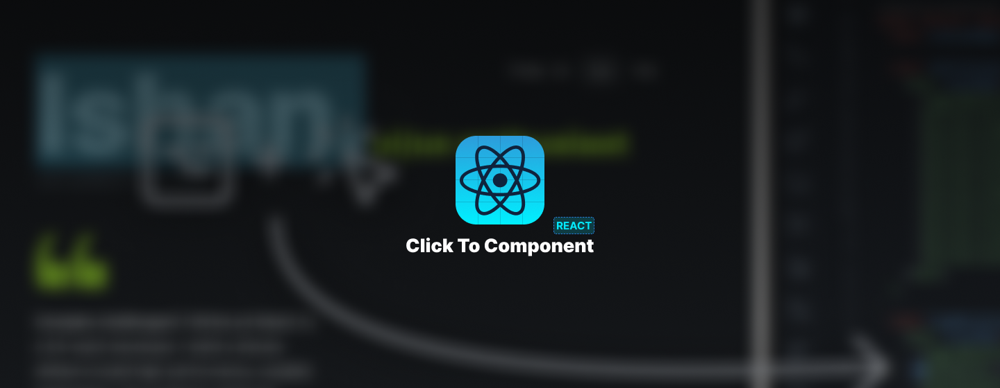
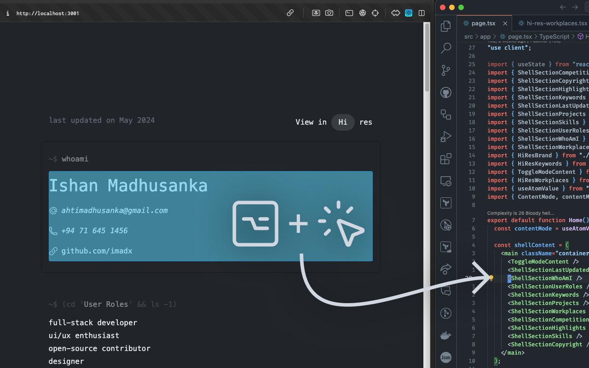
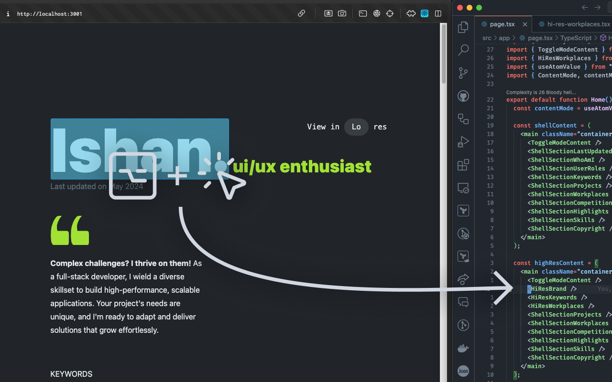

# React Click to Component Extension



This extension is a simple extension that allows you to click on a component name in a React file and open the file
where the component is defined on your editor.

Inspired by [ericclemmons/click-to-component](https://github.com/ericclemmons/click-to-component)
and [React Dev Tools](https://react.dev/learn/react-developer-tools)

To see how this works, checkout the repo at and raise any issues on the extension at
the [GitHub repository](https://github.com/imadx/react-click-to-component-chrome-extension/issues).
And if you like the extension, star the repo too!

## Features

- `Option + Click` or `Alt + Click` on a component to open the file in an editor
- Highlight the component name when hovering over it with `Option`/`Alt` key pressed
- Supports Turbopack builds with manually defined project roots (that can be changed simply by updating the localStorage
  key `clickToReact-projectPath-{HOST}`)
- Now the extension copies the path to clipboard instead of opening the file, for editors that doesn't support opening
  `file://` URLs. You can set the editor with `clickToReact-editor-{HOST}` localStorage key.

## Configuration

The extension can be configured to work with your project by setting the `clickToReact-projectPath-{HOST}` localStorage
key. This is helpful when you are using a build tool like Turbopack that generates a different path for your project.

To set the project path, open the Chrome DevTools console and run the following command:

```javascript
localStorage.setItem('clickToReact-projectPath-{HOST}', 'path/to/your/project');
// eg: localStorage.setItem('clickToReact-projectPath-localhost:3000', '/Users/username/project');
```

To set the editor to copy the path to clipboard, you can set the `clickToReact-editor-{HOST}` localStorage key. This
will copy the path to clipboard instead of opening the file if the editor is not supported.
Then you can paste the path in your editor easily to open the file.

```javascript
localStorage.setItem('clickToReact-editor-{HOST}', 'webstorm');
// eg: localStorage.setItem('clickToReact-editor-localhost:3000', 'webstorm');
```

## Screenshots

Here are some screenshots of the React Click to Component Extension in action:





Feel free to explore the extension and enjoy the enhanced productivity it brings to your React development workflow!
